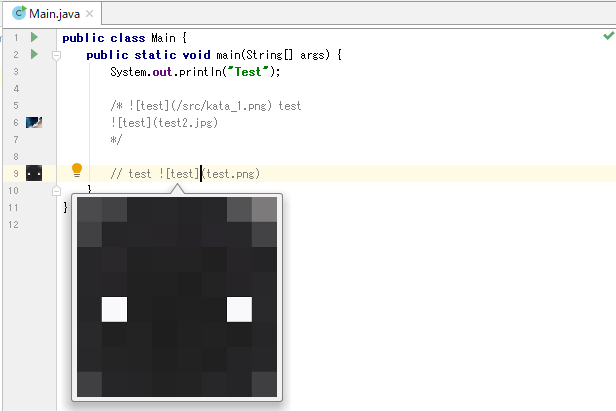

# ImageComment

Do you think that intention will be transmitted only by the character of the comment?
> No. We need images.

[Jetbrains Plugins](https://plugins.jetbrains.com/plugin/11170-imagecomment)

### Getting Started
1. Write `` in comment!

## UI
||
|:--:|
||
